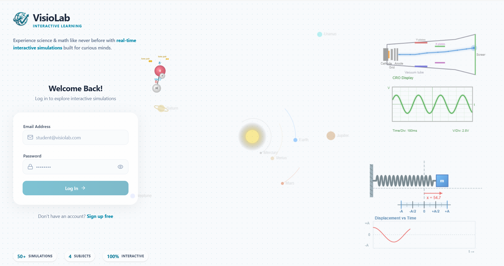
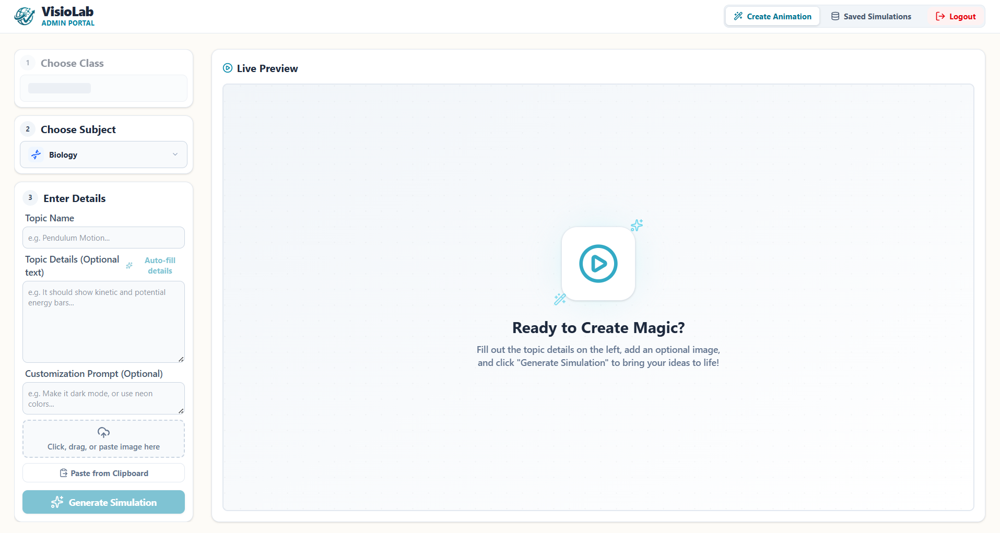
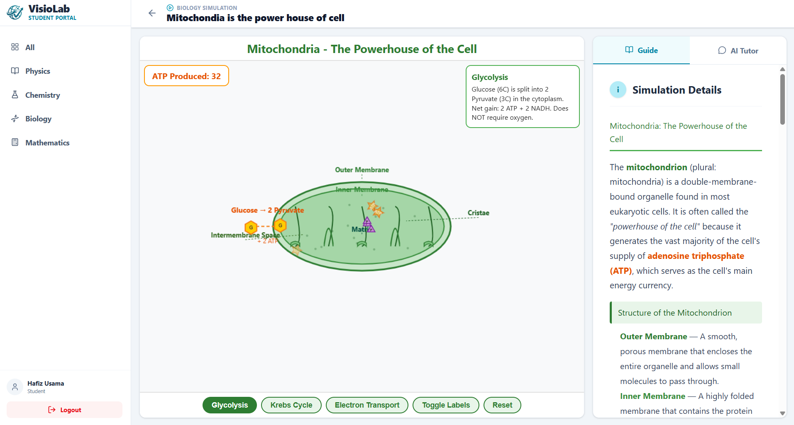
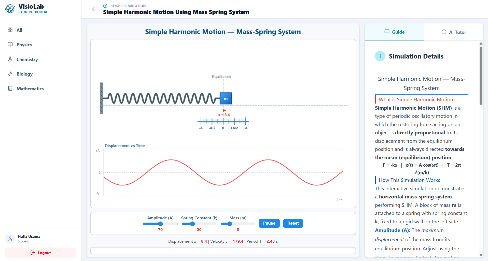
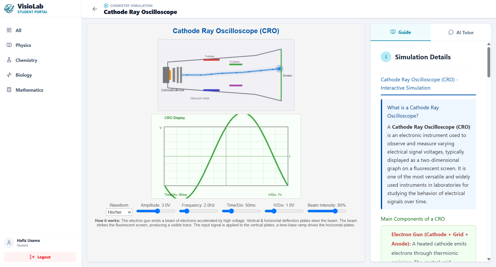
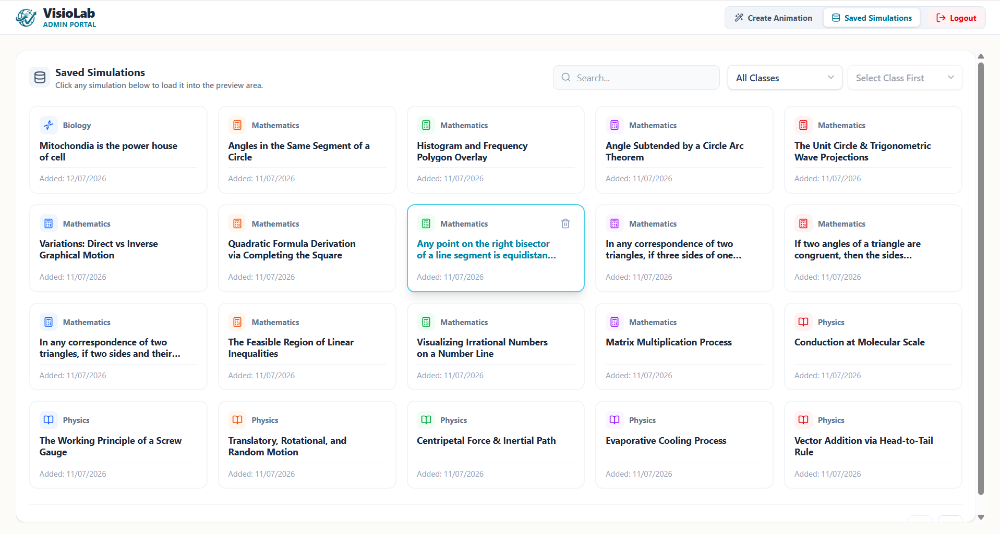

<div align="center">
  
  <h1>Co-Tutor</h1>
  <p><strong>Experience Science & Math like never before with Real-Time Interactive Simulations</strong></p>
  
  <p>
    
    
    
    
  </p>
</div>

---

## 🌟 Overview 

**Co-Tutor** is a state-of-the-art educational platform that redefines how students learn STEM (Science, Technology, Engineering, and Mathematics). By leveraging the power of Artificial Intelligence, educators can instantly generate fully functional, interactive simulations that bring abstract concepts to life. 

With over **50+ Simulations**, covering **4 Subjects** (Physics, Chemistry, Biology, Mathematics), and delivering a **100% Interactive** experience, Co-Tutor bridges the gap between theoretical knowledge and practical understanding.

The ecosystem is divided into two perfectly synchronized, modern applications:
1. 🎓 **Student Portal** ([Live Demo](https://co-tutor-std.vercel.app/)): A focused, gamified, and distraction-free environment where students can explore simulations, adjust parameters in real-time, and learn via a built-in AI Tutor and interactive Study Guides.
2. 👨‍🏫 **Admin Portal** ([Live Demo](https://co-tutor-admin.vercel.app/)): A powerful dashboard empowering educators to dynamically generate, preview, customize, and publish simulations using simple text prompts and images.

---

## ✨ Key Features

### 🎓 For Students
- **Real-Time Interactive Simulations**: Manipulate variables (e.g., Amplitude, Spring Constant, Mass) and instantly see the results in high-quality physics and biology visualizations.
- **Dynamic Data & Graphs**: Watch real-time graphing (e.g., Displacement vs. Time) and live metrics update as you interact with the simulation.
- **Built-in AI Tutor**: Stuck on a concept? The integrated AI Tutor provides contextual, step-by-step help specific to the current simulation.
- **Comprehensive Study Guides**: Rich text guides explaining the formulas, theories, and concepts (e.g., $F = -kx$) directly alongside the interactive model.
- **Premium Gamified Interface**: Engaging planetary motion backgrounds and sleek, user-friendly layouts make learning visually amazing.

### 👨‍🏫 For Educators & Admins
- **Generative AI Simulations**: Simply enter a topic name, provide details or images, and add a customization prompt. The AI will instantly write the HTML/JS payload for a fully functional simulation.
- **Live Preview Environment**: Test the generated simulation in an isolated Sandbox/Iframe to ensure quality before publishing.
- **Content Management**: Organize and manage all generated content effortlessly with the "Saved Simulations" library, categorizing them by Class and Subject.

### 🛠️ Technical Highlights
- **Beautiful UI/UX**: Designed with a premium white-card aesthetic, smooth micro-animations, glassmorphism, and responsive Tailwind layouts.
- **Secure Architecture**: Fully integrated with Supabase for robust user authentication and strict Row Level Security (RLS).

---

## 📸 Sneak Peek

| Student Portal - Login | Admin Portal - Create Magic |
| :---: | :---: |
|  |  |

| Biology Simulation (Mitochondria) | Physics Simulation (Harmonic Motion) |
| :---: | :---: |
|  |  |

| Chemistry Simulation | Admin Portal - Saved Simulations |
| :---: | :---: |
|  |  |

---

## 💻 Tech Stack

- **Frontend Framework**: React 18 powered by Vite
- **Styling**: Tailwind CSS & Lucide React Icons
- **Database & Auth**: Supabase (PostgreSQL, Auth, RLS)
- **AI Integration**: Custom Edge Functions via Supabase (integrating advanced LLMs)
- **Simulations**: Native HTML5 Canvas / JS generated payloads

---

## 🔍 Deep Dive: Architecture & Libraries

Co-Tutor is split into two specialized applications to optimize the user experience for both educators and students. Here is a technical breakdown of each panel's features and the specific open-source libraries powering them.

### 👨‍🏫 Admin Panel (Simulation Generator)
The Admin Panel is designed as a powerful workspace for educators to prompt, build, and publish interactive simulations.

**Core Features:**
- **AI Prompt Engine Wizard:** A multi-step generative UI allowing teachers to customize environment styles (Physics vs Charts), themes, and interaction types (Sliders vs Drag-and-Drop) before generating code.
- **Live Preview Sandbox:** Safely renders AI-generated HTML/JS payloads within isolated iframes. Features an integrated Undo/Redo timeline to scrub through AI updates.
- **Rich Text Guide Editor:** A built-in WYSIWYG editor allowing teachers to write formatted supplementary study material and LaTeX equations alongside the simulation.

**Libraries Used:**
- **`react-simple-wysiwyg`**: Powers the lightweight, robust rich-text editing experience for writing simulation descriptions.
- **`katex`**: Used to preprocess and flawlessly render complex mathematical LaTeX equations within the generated descriptions.
- **`lucide-react`**: Provides the clean, modern iconography used throughout the Wizard and layout.
- **`@tanstack/react-query`**: Handles fetching, caching, and syncing the library of saved simulations from the database.
- **`sonner`**: Delivers beautiful, toast-based success and error notifications during the AI generation process.

### 🎓 Student Panel (Learning Environment)
The Student Panel focuses on a distraction-free, gamified experience where students can interact with the published simulations and learn at their own pace.

**Core Features:**
- **Interactive Simulation Viewer:** Consumes and mounts the raw interactive payloads generated by the Admin panel.
- **AI Contextual Tutor:** A built-in chat interface that understands the currently active simulation and provides students with step-by-step guidance, formulas, and Q&A.
- **Export & Print Capabilities:** Allows students to capture their learning by downloading study guides to Word Documents or directly printing the simulation states.

**Libraries Used:**
- **`react-markdown` & `marked`**: Crucial for parsing and safely rendering the dynamic markdown responses streamed from the AI Tutor chat.
- **`file-saver` & `markdown-docx`**: Powers the functionality allowing students to instantly export their AI-generated study guides into beautifully formatted Microsoft Word `.docx` files.
- **`react-to-print`**: Enables students to directly print out their interactive simulation views and study notes.
- **`html2canvas`**: Used to capture screenshot snapshots of the live HTML5 canvas simulations for saving or sharing.
- **`katex`**: Ensures that math equations presented by the AI Tutor or in the study guides are perfectly typeset.

### 🔌 Shared Infrastructure (Both Panels)
- **`vite` & `react`**: Provides the lightning-fast HMR and component-based foundation.
- **`tailwindcss`**: Drives the responsive, modern UI design, including the glassmorphism effects and animations.
- **`react-router-dom`**: Manages the client-side routing between dashboards, viewers, and login screens.
- **`@supabase/supabase-js`**: The backbone of the application. Handles user authentication, executes the Serverless Edge Functions for the AI LLM calls, and manages the PostgreSQL database storing the simulation payloads.

---

## 📂 Project Structure

Co-Tutor is a monorepo containing two independent web applications:

```text
Co-Tutor/
├── admin-panel/         # React app for teachers/admins
│   ├── src/             # Admin components, contexts, hooks, pages
│   └── public/          # Admin static assets
├── student-panel/       # React app for students
│   ├── src/             # Student components (AI Tutor, Guides), pages
│   └── public/          # Student static assets
├── supabase/            # Supabase Edge Functions & Database Migrations
└── README.md            # Project documentation
```

---

## 🚀 Getting Started

Follow these instructions to set up the project locally.

### Prerequisites
- [Node.js](https://nodejs.org/) (v16 or higher)
- npm or yarn
- A [Supabase](https://supabase.com/) Project (URL and Anon Key)
- An AI Provider API Key (e.g., Fireworks AI) for the AI Tutor and Generator

### 1. Clone the repository
```bash
git clone https://github.com/yourusername/co-tutor.git
cd co-tutor
```

### 2. Environment Setup
Create a `.env` file in the root of **both** `admin-panel` and `student-panel` directories.
```env
VITE_SUPABASE_URL=your_supabase_url
VITE_SUPABASE_ANON_KEY=your_supabase_anon_key
```

### 3. Install Dependencies
```bash
# Install Admin Panel dependencies
cd admin-panel
npm install

# Install Student Panel dependencies
cd ../student-panel
npm install
```

### 4. Run the Development Servers
Open two terminal windows to run both panels simultaneously:

**Terminal 1 (Admin Panel)**
```bash
cd admin-panel
npm run dev
# Defaults to http://localhost:5173
```

**Terminal 2 (Student Panel)**
```bash
cd student-panel
npm run dev
# Defaults to http://localhost:5174
```

---

## 🔒 Database Architecture

Co-Tutor relies on Supabase for a seamless backend experience with secure data access:
- **`users` / Auth**: Secure management of student and admin roles.
- **`classes` & `subjects`**: Hierarchical organization of the academic curriculum.
- **`topics`**: Granular lesson definitions.
- **`simulations`**: Stores the raw HTML/JS interactive payloads, ensuring fast delivery to the student portal.
- **Row Level Security (RLS)**: Guarantees that students only interact with published material, while admins retain full CRUD capabilities.

---

## 🤝 Contributing

We welcome contributions to make Co-Tutor even better! 
1. Fork the Project
2. Create your Feature Branch (`git checkout -b feature/AmazingFeature`)
3. Commit your Changes (`git commit -m 'Add some AmazingFeature'`)
4. Push to the Branch (`git push origin feature/AmazingFeature`)
5. Open a Pull Request

---

## 👥 Team

**Project Supervisor:**
- Dr. M. Zeeshan Asaf 

**Team Members:**
- M Tauseef Haider
- Hafiz M Usama
---

<div align="center">
  <p>Built with ❤️ for modern education. Empowering the curious minds of tomorrow.</p>
</div>
