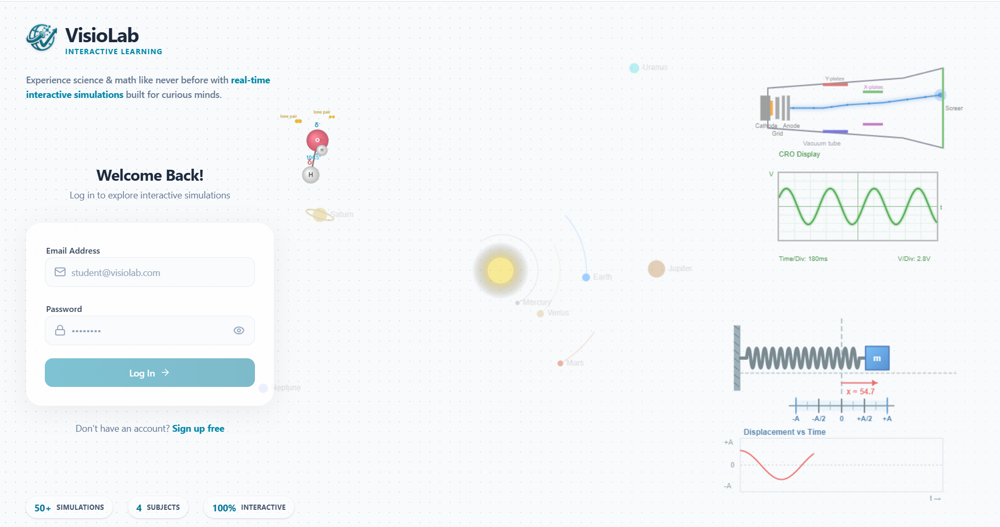
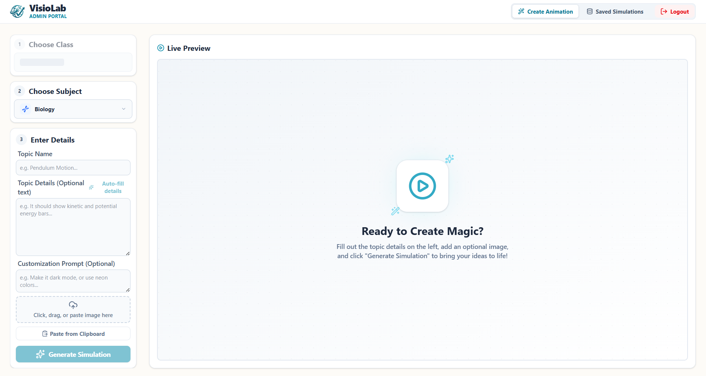
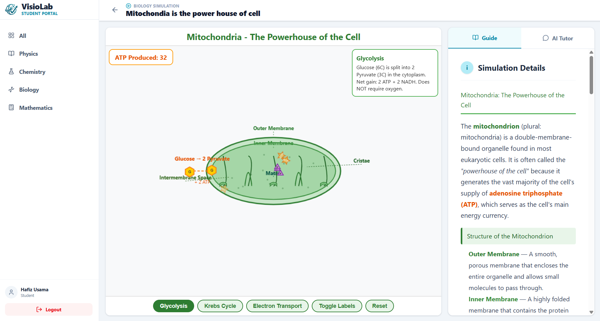
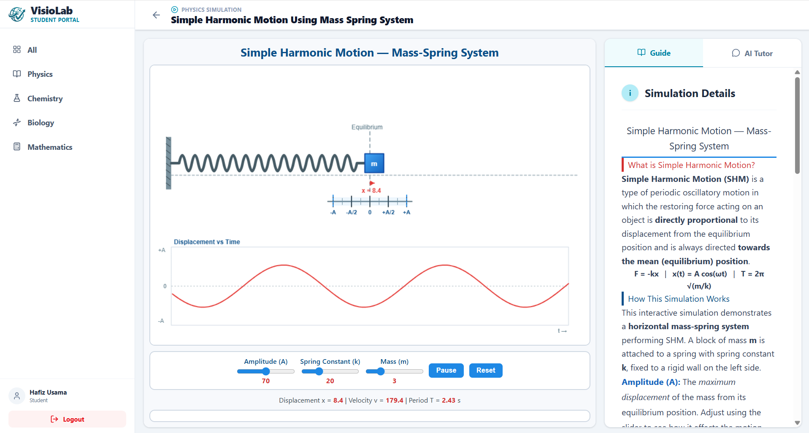
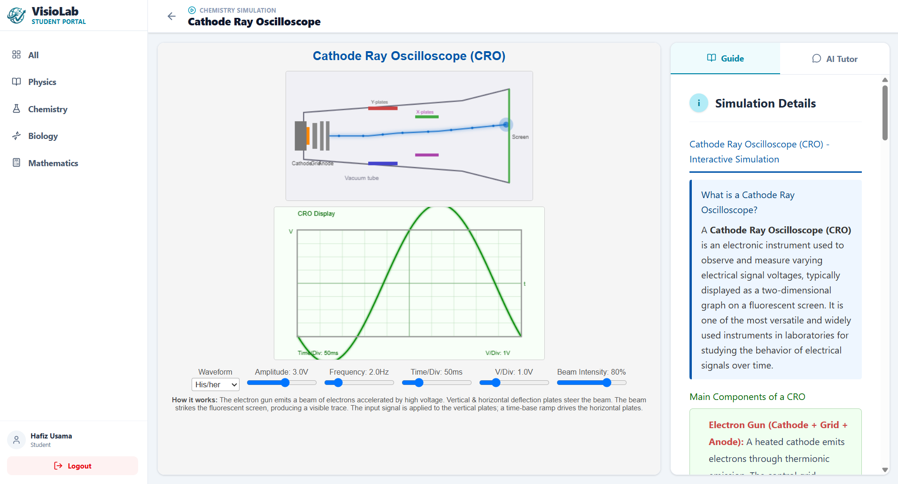
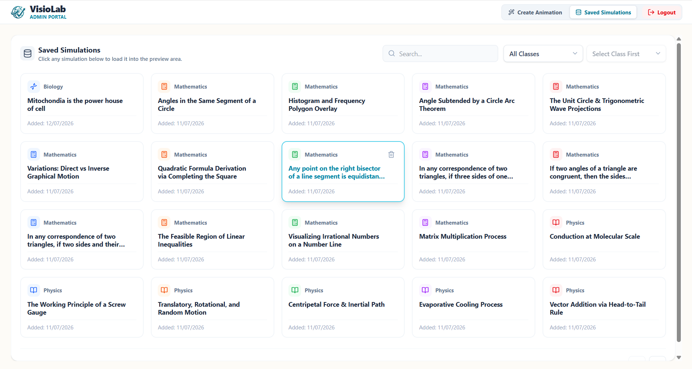

<div align="center">
  
  <h1>Tutre</h1>
  <p><strong>Interactive STEM simulations, generated by AI and taught alongside an AI tutor.</strong></p>
  <p>
    
    
    
    
  </p>
</div>

---

## Table of contents

- [What Tutre is](#what-tutre-is)
- [How it works](#how-it-works)
- [Repository layout](#repository-layout)
- [Getting started](#getting-started)
  - [Prerequisites](#1-prerequisites)
  - [Clone](#2-clone)
  - [Environment variables](#3-environment-variables)
  - [Install](#4-install)
  - [Run](#5-run)
  - [Log in](#6-log-in)
- [Everyday commands](#everyday-commands)
- [Architecture](#architecture)
- [Database](#database)
- [Edge Functions](#edge-functions)
- [Security model](#security-model)
- [Troubleshooting](#troubleshooting)
- [Deployment](#deployment)
- [Contributing](#contributing)
- [Content today](#content-today)
- [Roadmap](#roadmap)
- [Project status](#project-status)
- [Team](#team)

---

## What Tutre is

Tutre is an educational platform for STEM. A teacher describes a topic in plain
language; an AI writes a self-contained, interactive HTML/JS simulation for it;
students open that simulation, drag the sliders, watch the graph move, and ask an
AI tutor questions about what they are seeing.

It ships as **two separate React applications** that share one Supabase backend:

| | Staff portal (admin panel) | Student panel |
| --- | --- | --- |
| Who | Teachers, principals and the Tutre content team | Students |
| Does | Studio: generates, previews, reviews and publishes simulations. My school: members, sections and invite codes. My sections: a teacher's classes | Browses curriculum, runs simulations, chats with the AI tutor, exports study guides |
| Dev port | `5173` | `5174` |
| Directory | `admin-panel/` | `student-panel/` |
| Live | [co-tutor-admin.vercel.app](https://co-tutor-admin.vercel.app/) | [co-tutor-std.vercel.app](https://co-tutor-std.vercel.app/) |

They are deployed independently and have no shared code — only a shared database.

> **Note on naming.** This project was previously called *Co-Tutor*. It is now
> **Tutre**. Some deployed URLs and the logo artwork still carry the old
> wordmark; the code does not.

---

## Screenshots

| Student portal — login | Admin portal — create a simulation |
| :---: | :---: |
|  |  |

| Biology simulation | Physics simulation |
| :---: | :---: |
|  |  |

| Chemistry simulation | Admin portal — saved simulations |
| :---: | :---: |
|  |  |

Screenshots predate the rename and still show the old *Co-Tutor* wordmark.

---

## How it works

```text
  Teacher                    Admin panel              Supabase              Student panel           Student
     |                            |                       |                       |                    |
     |-- "Simple harmonic ------->|                       |                       |                    |
     |    motion, class 11"       |                       |                       |                    |
     |                            |-- Edge Function ----->|                       |                    |
     |                            |   (LLM writes HTML)   |                       |                    |
     |                            |<-- HTML payload ------|                       |                    |
     |<-- sandboxed preview ------|                       |                       |                    |
     |                            |                       |                       |                    |
     |-- publish ---------------->|-- INSERT payload ---->|                       |                    |
     |                            |                       |                       |                    |
     |                            |                       |<-- SELECT ------------|<-- open topic -----|
     |                            |                       |--- HTML payload ----->|                    |
     |                            |                       |                       |-- sandboxed ------>|
     |                            |                       |                       |   iframe render    |
     |                            |                       |<-- chat-tutor --------|<-- "why does ------|
     |                            |                       |--- streamed answer -->|    amplitude...?"  |
```

The important consequence: **a simulation is a blob of AI-written HTML/JS stored
in a database row.** It is untrusted code. Both panels render it inside a
sandboxed `<iframe>`, and that isolation is not optional. See
[Security model](#security-model).

---

## Repository layout

```text
Tutre/
├── admin-panel/              React + Vite app for teachers
│   ├── public/               Static assets served at the web root
│   ├── src/
│   │   ├── components/       Shared UI (layout, common widgets, skeletons)
│   │   ├── context/          Auth context and provider
│   │   ├── features/         Feature folders — the bulk of the app
│   │   │   ├── auth/
│   │   │   ├── curriculum/   Classes, subjects, chapters CRUD
│   │   │   └── simulations/  Generation wizard, live preview, saved library
│   │   ├── pages/            Route-level screens
│   │   ├── routes/           Router config and ProtectedRoute
│   │   ├── services/         Supabase client, auth API
│   │   └── utils/            sanitizeHTML and friends
│   ├── .env                  Local secrets — git-ignored
│   ├── .env.example          Template — tracked
│   └── vite.config.js
│
├── student-panel/            React + Vite app for students
│   └── src/                  Same shape: components / features / pages /
│                             routes / services / utils
│                             features: auth, landing, dashboard, simulations
│
├── supabase/                 Backend as code
│   ├── config.toml           Supabase CLI config
│   ├── migrations/           Schema history — see supabase/README.md
│   ├── functions/            Edge Function source — see supabase/README.md
│   └── README.md             What is known, what is missing, how to pull it
│
├── .github/                  Issue and pull-request templates, CI workflow
├── graphify-out/             Generated code-graph analysis. Not app code.
├── CONTRIBUTING.md           Working agreement for the team
└── README.md                 This file
```

`CLAUDE.md` and `.claude/` may also exist in your working copy. They are local AI
assistant configuration, are deliberately git-ignored, and are not part of the
project. Do not rely on them being present after a fresh clone.

There is **no root `package.json`** and no workspace tooling. The two panels are
independent npm projects; install and run each one separately.

---

## Getting started

### 1. Prerequisites

| Tool | Version | Why |
| --- | --- | --- |
| Node.js | **20.19+ or 22+** | Vite 8 and React 19 require it. Node 18 will fail. |
| npm | 10+ | Ships with Node |
| Git | any recent | |
| A Supabase project | — | URL + publishable key. You cannot run Tutre without one. |

Check your Node version:

```bash
node -v
```

### 2. Clone

```bash
git clone https://github.com/d0t-J/Tutre.git
cd Tutre
```

### 3. Environment variables

Each panel needs its own `.env`. Copy the tracked templates:

```bash
cp admin-panel/.env.example admin-panel/.env
cp student-panel/.env.example student-panel/.env
```

Then fill in both files with the same values:

| Variable | Required | What it is |
| --- | --- | --- |
| `VITE_SUPABASE_URL` | yes | `https://<project-ref>.supabase.co` |
| `VITE_SUPABASE_PUBLISHABLE_KEY` | preferred | The publishable key (`sb_publishable_…`). The app reads this first. |
| `VITE_SUPABASE_ANON_KEY` | fallback | The legacy anon key (`eyJ…`). Used only if the publishable key is unset. |

Find both in the Supabase dashboard under **Project Settings → API**.

> **Never put a service-role key in a `.env` here.** Anything prefixed `VITE_` is
> compiled into the public browser bundle and is readable by every visitor. The
> publishable and anon keys are designed for that; the service-role key bypasses
> Row Level Security and would hand the whole database to anyone who opens
> DevTools.

AI provider keys are **not** configured here either. They live as Edge Function
secrets on the Supabase side. See [Edge Functions](#edge-functions).

### 4. Install

```bash
npm install --prefix admin-panel
npm install --prefix student-panel
```

### 5. Run

Two terminals, one per panel:

```bash
npm run dev --prefix admin-panel     # http://localhost:5173
```

```bash
npm run dev --prefix student-panel   # http://localhost:5174
```

The admin panel's first cold start takes noticeably longer than the student
panel's — Vite has to pre-bundle the Jodit rich-text editor. Later starts are
fast.

### 6. Log in

Both panels redirect to a login screen; neither shows data to an anonymous
visitor, by design.

- **Student panel** — sign up at `/login` and use the new account.
- **Staff portal (admin panel)** — anyone can create an account at `/login`,
  but it only opens up after joining a school with a staff code (teacher or
  school admin) on the Join page, or for the Tutre content team, whose user id is
  in `admin_users`. Teachers and principals cannot use the student panel; it
  sends them to the staff portal. Set `VITE_STUDENT_APP_URL` and
  `VITE_STAFF_PORTAL_URL` (see the `.env.example` files) so each app can link to
  the other.

If the dashboard loads but shows no classes or subjects, you are almost certainly
not signed in, or your account lacks the rows RLS requires. That is expected
behaviour, not a bug.

---

## Everyday commands

Run from the repository root:

```bash
npm run dev     --prefix admin-panel     # dev server on 5173
npm run dev     --prefix student-panel   # dev server on 5174
npm run build   --prefix admin-panel     # production build to admin-panel/dist
npm run build   --prefix student-panel   # production build to student-panel/dist
npm run preview --prefix admin-panel     # serve the built output locally
npm run lint    --prefix admin-panel     # ESLint
npm run lint    --prefix student-panel
```

**There is no test suite.** "Verified" in this project means: the build passes,
lint passes, and the affected screen was exercised in a running browser. Treat
that as the bar before calling a change done.

---

## Architecture

Both panels follow the same conventions. Learn one, you know the other.

**Language.** Plain JavaScript and JSX. No TypeScript. Do not introduce it
piecemeal.

**Feature folders.** Application code lives under `src/features/<feature>/`, each
holding its own `components/`, `hooks/`, `context/` and `utils/`. Shared,
genuinely generic UI lives in `src/components/`.

**Server state.** `@tanstack/react-query` owns everything fetched from Supabase —
caching, refetching, invalidation. Do not hand-roll fetch-and-`useState` for data
that lives in the database.

**Client state.** React context providers, one per concern
(`AuthProvider`, `SimulationProvider`, `WizardProvider`,
`SimulationViewerProvider`). No Redux, no Zustand.

**Routing.** `react-router-dom` v7. `ProtectedRoute` gates authenticated screens.
It is a user-experience guard, not a security boundary — see below.

**Styling.** Tailwind CSS v4 via `@tailwindcss/vite`. No separate config file;
Tailwind 4 is configured from CSS in `src/styles/index.css`.

**Notable dependencies.**

| Package | Used for | Where |
| --- | --- | --- |
| `@supabase/supabase-js` | Database, auth, Edge Function calls | both |
| `@tanstack/react-query` | Server-state cache | both |
| `dompurify` | Sanitising AI-generated HTML | both |
| `katex`, `remark-math`, `rehype-katex` | LaTeX in study guides and tutor replies | both |
| `marked` | Markdown from streamed AI responses | both |
| `jodit-react`, `@uiw/react-md-editor` | Study-guide authoring | admin |
| `lucide-react`, `sonner` | Icons, toasts | both |
| `jspdf`, `html2pdf.js`, `html2canvas`, `react-to-print` | Study-guide export and print | student |
| `markdown-docx` | `.docx` export of study guides | student |

---

## Database

Supabase (PostgreSQL) is part of the application architecture, not an optional
add-on. Both panels talk to it directly.

**Core tables**

| Table | Holds |
| --- | --- |
| `classes` | Class levels (9, 10, 11, 12) |
| `subjects` | Subjects within a class — `class_id` foreign key |
| `chapters` | Chapters within a subject — `subject_id`, `chapter_no` |
| `topics` | Individual lessons, including the `study_guide` body |
| `admin_users` | The Tutre content team (Studio), with a `studio_role` |

**Simulations** live in one `simulations` table with a review workflow
(draft, in review, published, archived) and version history. Students read only
published rows. **`all_simulations`** is a view that joins them to the
curriculum tree; both panels read from it. The old per-subject tables
(`physics_simulations` and so on) are a frozen backup that nothing reads.

**Schools** (`organizations`, `org_memberships` with a head admin, `sections`,
`section_members`, `invite_codes` including each section's class code),
**teachers' own material** (`teacher_materials`, `material_shares`), **learning
progress** (`learning_events`, `topic_progress`) and **Urdu content**
(`content_translations`, `glossary_terms`) complete the schema.
[`supabase/README.md`](./supabase/README.md) documents every table, who can
read and change it, and why.

### Migrations

Schema changes must be represented as migrations under `supabase/migrations/`. A
change that exists only in the hosted project is a change this repository cannot
reproduce.

Every table, view, policy and function is in `supabase/migrations/`, starting
from the baseline pulled from the hosted project on 2026-09-30, and the hosted
project is kept in step with it (`npx supabase migration list`). Access rules are
tested with pgTAP in `supabase/tests/database/`.
Read it before touching the database.

Destructive changes — `DROP`, destructive `ALTER`, deletes, truncates, or
rewriting RLS policies — need explicit approval every time.

---

## Edge Functions

Server-side functions on Supabase, holding the AI provider credentials so the
browser never sees them.

| Function | Purpose | Called from |
| --- | --- | --- |
| `chat-tutor` | Streams AI tutor replies and study-guide text | both panels |
| `generate-simulation-prompt` | Builds the generation prompt from wizard input | admin |
| `suggest-requirements` | Suggests simulation requirements for a topic | admin |
| `extract-html-details` | Pulls title and description out of uploaded HTML | admin |
| `send-whatsapp` | Delivers a study guide over WhatsApp | student |

Streaming functions are called with `fetch` against
`${VITE_SUPABASE_URL}/functions/v1/<name>`; the rest go through
`supabase.functions.invoke(...)`.

Their source is not yet in this repository — see `supabase/README.md` for how to
download it.

> **Known issue.** `send-whatsapp` reads and writes a `whatsapp_documents` table
> that does not exist in the hosted project, so the WhatsApp feature fails at
> runtime. Whether to create the table or retire the feature is an open decision.

---

## Security model

Four rules. None of them are negotiable.

**1. AI-generated HTML is untrusted input.** A `code_payload` is model output
stored in a database row. Treat it exactly as you would treat HTML pasted by an
anonymous stranger.

**2. Iframe isolation is load-bearing.** Simulations render inside sandboxed
iframes — `ResponsiveSimulationFrame`, `ViewerIframe`, `LivePreview`. Do not
widen the sandbox, remove it, or move a payload into the host document. Keep
`dompurify` and `utils/sanitizeHTML.js` in the render path.

**3. RLS is the authorization boundary.** Row Level Security decides who may read
and write what. `ProtectedRoute` is a redirect for the user's benefit; it stops
nobody who can open DevTools. Never disable RLS, and never work around it with a
privileged key on the client.

**4. Secrets stay out of the repository and out of the bundle.** `.env` files are
git-ignored; `.env.example` files carry names only, never values. AI provider
keys, WhatsApp credentials, database passwords and the service-role key belong in
Supabase server-side configuration.

---

## Troubleshooting

**Blank page, console says `supabaseUrl is required`**
The panel's `.env` is missing or empty. Vite reads `.env` only at server start —
create the file, then restart the dev server.

**`.env` changes have no effect**
Restart the dev server. Vite does not hot-reload environment variables.

**Dashboard loads but every list is empty**
You are not signed in, or RLS is denying your account. Anonymous users see no
curriculum data by design. Confirm you are logged in; for the admin panel,
confirm your user id exists in `admin_users`.

**Admin login succeeds, then bounces back to `/login`**
The account authenticated but is not in `admin_users`. Student accounts cannot
use the admin panel.

**Port 5173 or 5174 already in use**
Something else is bound to it. Stop that process, or run
`npm run dev --prefix admin-panel -- --port 5175`.

**`npm install` fails on peer dependencies**
Check `node -v`. Node 18 cannot build this project; you need 20.19+ or 22+.

**Admin dev server is slow to start**
Expected on a cold start — Vite pre-bundles Jodit. Subsequent starts use the
cache.

**Build warns that a chunk exceeds 500 kB**
Known and currently accepted. The panels ship as single large bundles. Code
splitting is a possible future change, not an approved one.

---

## Deployment

Both panels deploy as static single-page apps. Each carries a `vercel.json` that
rewrites all paths to `/index.html` so client-side routing survives a page
refresh.

For each panel: build with `npm run build`, publish the `dist/` directory, and set
`VITE_SUPABASE_URL` and `VITE_SUPABASE_PUBLISHABLE_KEY` as environment variables
in the host. They are baked in at build time, so changing them requires a rebuild.

Supabase itself — schema, RLS policies and Edge Functions — is deployed
separately through the Supabase CLI.

---

## Contributing

Read [CONTRIBUTING.md](./CONTRIBUTING.md) before your first change. It is the
full working agreement: ground rules, branch and commit conventions, the
verification bar, database rules and security expectations.

The short version:

- **Preserve existing behaviour.** Breaking a working feature is a regression
  even if the new code is better.
- **Prefer additive changes.** Add alongside; do not rewrite in place.
- **One concern per branch.** Do not mix unrelated changes.
- **Verify before claiming done.** Build, lint, and open the screen.
- **Schema changes need a migration.** Destructive ones need explicit approval.
- **No secrets in the diff.** Ever.

```bash
git checkout -b feat/your-change
# ... work ...
npm run build --prefix admin-panel && npm run lint --prefix admin-panel
npm run build --prefix student-panel && npm run lint --prefix student-panel
git commit -m "feat: describe what changed and why"
git push origin feat/your-change
```

CI runs lint and build for both panels on every pull request
(`.github/workflows/ci.yml`). It needs no secrets.

One repository-specific trap: the root `.gitignore` is **deny-by-default** (`/*`
plus explicit `!` negations). A new top-level file is invisible to git until you
add a matching `!` line. Check with:

```bash
git check-ignore -v <path>
```

---

## Content today

Counts read from the live database on 2026-09-30.

| Class | Biology | Chemistry | Mathematics | Physics | Total |
| --- | ---: | ---: | ---: | ---: | ---: |
| Class 9 | 17 | 14 | 7 | 24 | **62** |
| Class 10 | 13 | 11 | 11 | 13 | **48** |
| **Total** | 30 | 25 | 18 | 37 | **110** |

Facts worth knowing before you plan content work:

- **There is no per-user content.** No `user_id`, no ownership, no draft or
  published flag anywhere in the schema. Every signed-up student sees the entire
  catalogue. "Default simulations" and "all simulations" are the same set.
- **Classes 11 and 12 have no simulations.** Neither does Computer Science.
- **92 of 110 simulations have no study guide** — the AI tutor and the export
  features have nothing to work from on those topics.
- Every simulation is assigned to a chapter; none are orphaned.
- The landing page's planetary-motion and water-molecule animations are
  hard-coded files under `student-panel/src/features/simulations/utils/`, not
  database rows. They are decoration, not content.

---

## Roadmap

Direction, not committed scope. Items become work when they have an issue and an
agreed plan.

**Next:** verified Computer Science simulations for classes 9–12, aligned to the
Punjab Curriculum and Textbook Board syllabus. This is the first content set
intended to be canonical rather than generated ad hoc.

The earlier blockers for that work are resolved: subjects have an
identifier-safe `slug`, all simulations live in one table (adding a subject
needs no schema change), and published, reviewed simulations are told apart
from drafts and from AI-generated ones (`status`, `kind`).

**Longer term:** performance and structure work on the generation and render path
as the catalogue grows.

**Inspiration, not requirement:** TinkerCAD informs how interaction should *feel*.
It is not a commitment to reproduce CAD, 3D modelling or circuit simulation.

---

## Project status

Tutre is a Final Year Project (CS-607, FYP-I) at the University of Agriculture,
Faisalabad. The application here is the working foundation, not a prototype
awaiting replacement.

Ideas raised in discussion stay proposals until they are explicitly approved.

---

## Team

**Supervisor** — Dr. M. Zeeshan Asaf

**Members** — M Tauseef Haider · Hafiz M Usama

---

<div align="center">
  <sub>Built for modern education.</sub>
</div>
